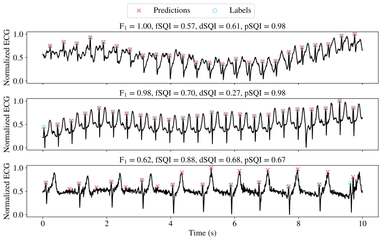

# Task and Metric Specific Signal Quality Indices for Medical Time-Series



This repository contains the reference implementation for the perturbation based task- and metric-specific signal quality index (pSQI). Given an algorithm and a metric that rates the algorithm's output w.r.t. a ground truth, the pSQI has been empirically shown to correlate with the algorithm's performance on a given input signal, as evaluated by the metric. The pSQI has been evaluated on three benchmarks: R-peak detection, ECG-based atrial fibrillation classification, and PPG-based atrial fibrillation classification. 

## Installation with (Mini)Conda
Create a new environment with Conda and install the required packages :
```
conda create -n psqi python==3.11.5
conda activate psqi
pip install -r requirements.txt
```
A CUDA compatible GPU is recommended for the comparison with the dSQI using PyTorch.

## Benchmarks
Run ```python peak_detection_experiment.py --config_path configs/peak_detection_config.yaml``` to reproduce the R-peak detection experiment.

Run ```python ecg_atrial_fibrillation_experiment.py --config_path configs/ecg_atrial_fibrillation_config.yaml``` to reproduce the ECG AF classification experiment.

Run ```python ppg_atrial_fibrillation_experiment.py --config_path configs/ppg_atrial_fibrillation_config.yaml``` to reproduce the ECG AF classification experiment.

Run ```python psqi_hyperparameter_experiment.py --config_path configs/psqi_hyperparameters/psqi_hyperparameter_config_local_snr_0.yaml``` to reproduce the pSQI hyperparameter experiments. Replace "0" with the local SNR value of your choice. The sweep in the python code is done over the global SNR.

The plots from the paper can be reproduced with the ```visualizations.ipynb``` notebook.

## Perturbation SQI
The following is a minimal usage example for the pSQI on the R-peak detection task using the FastNVG algorithm and the F1 metric.
```python
import medsqi.datasets.gudb as gudb
from medsqi.evaluation.utils import f1_with_tolerance, get_best_margin
from medsqi.methods.perturbation_methods import PerturbationSQI
from vg_beat_detectors.fast_nvg import FastNVG
from scipy.stats import binned_statistic, spearmanr
import numpy as np

def get_metrics(ecgs, annotations, fs):
    nvg = FastNVG(sampling_frequency=fs)
    metrics = []
    for i in range(ecgs.shape[0]):
        peaks = nvg.find_peaks(ecgs[i, :]) / fs
        metrics.append(f1_with_tolerance(annotations[i]/fs, peaks))
    metrics = np.stack(metrics, axis=0)
    return metrics

# Load in ECGs and R-peak annotations
gudb_path = "/home/jhaidamous/CorruptedECGDatasets/gudb/docs/experiment_data" # Replace with your own path
ecgs, annotations = gudb.load_gudb(gudb_path)
fs = gudb.fs
# Get the F1 metric values
metrics = get_metrics(ecgs, annotations, fs)

psqi = PerturbationSQI(algorithm=lambda x: FastNVG(sampling_frequency=fs).find_peaks(x)/fs, metric=f1_with_tolerance, fs=fs, random_state=42)
preds = psqi.predict(ecgs)

bins = np.linspace(0, 1, 26)
stats, edges, _ = binned_statistic(preds, metrics, statistic='mean', bins=bins)

centers = (edges[:-1] + edges[1:]) / 2

print(f"Spearman Correlation Coefficient: {spearmanr(centers[np.isfinite(stats)], stats[np.isfinite(stats)])[0]:.3f}")
print(f"Optimal Separation Margin: {get_best_margin(metrics, preds)[0]:.3f}")
```